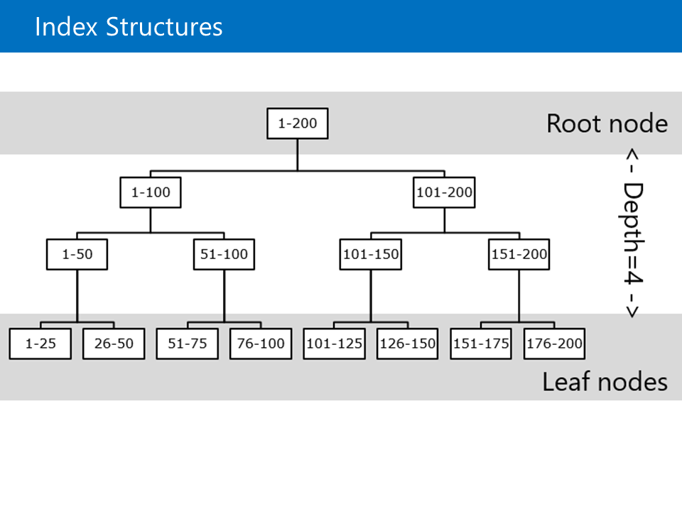

# 🎯 **НАЙ-ВАЖНИТЕ НЕЩА ЗА ЗАПОМНЯНЕ**

## 1. **ИНДЕКСИРАНЕ**
- **Кластериран индекс** → подрежда данните ФИЗИЧЕСКИ
- **Clustered vs Heap** – таблици без класиран индекс (heap) са по-бавни за някои операции.
- Добрия индекс подобрява SELECT, но забавя INSERT/UPDATE/DELETE.
* **Covering indexes** – индекс, който съдържа всички нужни колони → заявката не чете таблицата.
* **INCLUDE** – добавя “покриващи” колони без да влияят на подредбата.
* **Filtered indexes** – индекс върху части от данни → по-малък и по-бърз.
- Без статистики → SQL Server е сляп → бавни заявки

## 2. **ТИПОВЕ ДАННИ ЗА ИНДЕКСИ**
- **Numeric** → НАЙ-БЪРЗИ (INT, BIGINT)
- **GUID** → НАЙ-БАВНИ (избягваме за Clustered индекси)
- **BIT** → почти безполезен за индексиране

## 3. **ФРАГМЕНТАЦИЯ**
- **Page Split** → ПРИЧИНА (при INSERT/UPDATE)
- **Фрагментация** → РЕЗУЛТАТ
- **Вътрешна** → страниците са полупразни
- **Външна** → страниците са разхвърляни

## 4. **QUERY STORE**
- "Черна кутия" на заявките
- Следи история на изпълненията
- Показва кога заявка се е забавила

## 5. **EXECUTION PLANS**
- **Estimated** → какво SQL Server *планира* да направи
- **Actual** → какво *реално* се е случило
- Ключов за откриване на проблеми

## ⚡ **ЗЛАТНИ ПРАВИЛА:**
1. **ВИНАГИ използвай кластериран индекс**
2. **Избягвай Heap таблици** (освен за много малки/временни)
3. **Numeric > Character** за индексиране
4. **Следи фрагментацията** и я поправяй периодично
5. **Query Store + Execution Plans** = най-добрият дует за диагностика


---------------------

# 🟦 **1. Типове данни и влиянието им върху производителността**

Основната идея е, че **правилният избор на тип данни прави заявките по-бързи и намалява размера на базата**.

### ✔ Какво е важно:

* **Числовите типове (int, bigint, smallint...)**
  → най-ефективни за сравнение и сортиране.

* **Датите (date, datetime, datetime2)**
  → малки като размер → също много бързи за сравнение.


* **По-малки типове → по-малко място → по-бързи индекси.**

### ✔ Защо това е важно?

* Когато колоните са компактни → повече редове се побират в една страница.
* Това намалява логическите четения и прави индекса по-бърз.

---

# 🟦 **2. Стратегии за индексиране (Index Strategies)**

Индексите са **най-силното средство за ускоряване на заявки**, но имат и цена.

### ✔ Какви видове техники се споменават:

* **Covering indexes** – индекс, който съдържа всички нужни колони → заявката не чете таблицата.
* **INCLUDE** – добавя “покриващи” колони без да влияят на подредбата.
* **Clustered vs Heap** – таблици без класиран индекс (heap) са по-бавни за някои операции.
* **Filtered indexes** – индекс върху части от данни → по-малък и по-бърз.


### ✔ Цена на индексите

* Индексите ускоряват SELECT.
* Но забавят **INSERT, UPDATE, DELETE**, защото трябва да обновяват допълнителни структури.


### ✔ Оптимизации при създаване на индекси

* **FILL FACTOR** — оставя място в страниците, за да се избегне фрагментация.
* **PAD INDEX** — контролира свободното пространство в нелеките нива на индекса.

* **Selectivity** (Селективност): колко малка част от редовете се връщат при търсене; висока селективност = малко редове спрямо общия брой.

* **Density** (Плътност): показва колко уникални са данните; висока плътност = много дубликати.

* **Index Depth** (Дълбочина на индекс): броят нива в индекса; често хората погрешно смятат, че индексите са дълбоки.
---
Най-важното от схемата и как да различаваме фрагментациите и page splits:

### 1. **Page Split е ПРИЧИНА, Фрагментация е РЕЗУЛТАТ**
- **Page Split** → действието, което създава проблема
- **Фрагментация** → следствието от това действие

### 2. **Два основни вида фрагментация:**

#### 🔹 **ВЪТРЕШНА Фрагментация** 
- **Как изглежда**: Страниците са "полупразни"
- **Причина**: След page split, данните се разделят на 2 страници
- **Ефект**: Повече страници за същите данни → повече I/O

#### 🔹 **ВЪНШНА Фрагментация**
- **Как изглежда**: Страниците са "разхвърляни" на диска
- **Причина**: Новите страници се създават на случайни места
- **Ефект**: Скачане между различни части на диска → бавно четене

## 🛠 **КАК ДА РАЗЛИЧАВАМЕ:**

### **Page Split vs Фрагментация:**
| **Page Split** | **Фрагментация** |
|----------------|------------------|
| **СЪБИТИЕ** (действие) | **СЪСТОЯНИЕ** (резултат) |
| **Кога**: При INSERT/UPDATE | **Кога**: След много splits |
| **Мигновено** | **Накопително** |


**💡 Запомни**: Page splits са нормални, но трябва да контролираме фрагментацията, която те причиняват!

-------------------
# 🟦 **3. Query Store — инструмент за анализ и оптимизация**

Query Store е като **“черна кутия”**, която записва как се изпълняват заявките във времето.

### ✔ Какво прави Query Store:

* Събира **история** на изпълненията на заявки.
* Съхранява **планове на изпълнение** (execution plans).
* Позволява да сравниш **стари и нови** планове → виждаш кога и защо нещо се е забавило.


### ✔ Ползи:

* Лесно открива най-тежките заявки.
* Данните се пазят в самата база и **преживяват рестартиране, failover и upgrade**.


### ✔ Защо е важно?

Понякога производителността пада, защото SQL Server е избрал **лош план**.
Query Store позволява:

* да видите кога това се е случило,
* да сравните плановете,
* да върнете по-добър план (force plan).

---

# 🟦 **4. Execution Plans — основата на оптимизацията**

В презентацията се обяснява защо execution plans са критични.

### ✔ Estimated Execution Plan

Показва как SQL Server *планира* да изпълни заявката.
Не съдържа реални статистики.


### ✔ Actual Execution Plan

Показва какво реално се е случило — брой прочетени редове, операции, време и др.
Използва се за диагностика при проблемни заявки.

### ✔ Как да ги видите (в SSMS)?

* Ctrl + L → Estimated
* Ctrl + M → Actual


### ✔ Най-добра практика:

Комбинирайте execution plans + Query Store за най-добър анализ.


По-добре да има индекс 

---

# 🟦 **5. Какво трябва да знае всеки администратор/разработчик според презентацията**

### ✔ Най-важните точки:

1. **Изборът на тип данни влияе пряко върху производителността.**
2. **Индексите са мощни, но трябва да се използват премерено.**
3. **Query Store е задължителен инструмент за мониторинг на заявки.**
4. **Execution plans са основният начин за откриване на проблеми.**
5. **Оптимизация ≠ магия — това е разбиране + анализ.**

---

# 🟩 **Кратка супер-обобщена версия (ако трябва да го кажеш на изпит)**

* Ползвай **малки и точни типове данни** — база → по-бърза.
* Избирай **правилни индекси**, за да ускориш SELECT, без да забавяш излишно UPDATE/INSERT.
* **Query Store** логва всички заявки и ти позволява да следиш кой забавя базата.
* **Execution plans** показват точно къде SQL Server харчи ресурси.
* Оптимизацията е комбинация от: **индекси + план + анализ на Query Store**.

--------------------


Ако таблица няма индекс тогава е KB
Има Балансирано дърво(не е binary)



1. What does Index Depth mean?
A. Number of Levels within the index

2. Maximum number of Nonclustered Indexes a table can have?
C. 999

3. Which two statements update statistics on a table and a specific index?
B. UPDATE STATISTICS Production.Product; ✔️ — updates all stats on the table.
C. UPDATE STATISTICS Production.Product PK_Product_ProductID; ✔️ — updates a specific index's stats.

1. Query Store Operation Mode — Which option is incorrect?
D. None of the above

2. What workload format does Database Engine Tuning Advisor not accept?
✅ B. XML File

3. Which plan type matches the descriptions?
✅ C. None of the Above


----------
## 📊 **СРАВНИТЕЛНА ТАБЛИЦА**

| Тип данни | Предимства ✅ | Недостатки ❌ | Употреба |
|-----------|---------------|---------------|----------|
| **Numeric** (INT, BIGINT, DECIMAL) | ⚡ **Много бързи**<br>🔢 **Компактни**<br>🎯 **Точни сравнения**<br>📈 **Добро сортиране** | 🔢 **Ограничен диапазон**<br>💾 **Прекалена прецизност** | PRIMARY KEY, често търсени числови полета |
| **Character** (VARCHAR, NVARCHAR) | 📝 **Гъвкави**<br>🌍 **Поддръжка на Unicode**<br>🔍 **Частично търсене** | 🐌 **По-бавни**<br>💾 **Заемат повече място**<br>⚠️ **Case-sensitive проблеми** | Имена, описания, кодове |
| **Date-Related** (DATE, DATETIME) | 📅 **Естествено сортиране**<br>⚡ **Ефективни за диапазони**<br>🔢 **Компактни** | 🕒 **Time zone проблеми**<br>📊 **Грешки в точността** | Дата на създаване, период на валидност |
| **GUID** (UNIQUEIDENTIFIER) | 🌐 **Уникални глобално**<br>🔒 **Безопасни**<br>⚡ **Лесно за репликация** | 💾 **Големи (16 байта)**<br>🎲 **Случайни → фрагментация**<br>🐌 **Бавни** | Дистрибутирани системи, replication |
| **BIT** | 💾 **Много компактни**<br>⚡ **Много бързи**<br>🔧 **Прости** | ❓ **Много ниска селективност**<br>⚠️ **Лоши за индексиране** | Флагове, булеви стойности |
| **Computed Columns** | 🧮 **Индексиране на изчисления**<br>⚡ **Подобряване на заявките**<br>🔍 **Сложна логика достъпна** | 💾 **Допълнително място**<br>⚠️ **Детерминистичност изискване**<br>🔧 **Сложна поддръжка** | Изчислява се често в WHERE клауза |

## 🎯 **КЛЮЧОВИ ИЗВОДИ:**

### **Общи характеристики:**
- **Всички типове** могат да бъдат индексирани
- **Всички** подлежат на фрагментация
- **Всички** подобряват търсенето, но забавят модификациите

### **Най-добри практики:**
1. **Използвай Numeric** за чести търсения и PK
2. **Избягвай GUID** за кластерирани индекси
3. **Ограничи Character** индекси до необходимата дължина
4. **BIT индексите** рядко са полезни (ниска селективност)
5. **Computed Columns** - само за често използвани изчисления

### **Скорост (бърз → бавен):**
**BIT → Numeric → Date → Character → Computed → GUID**

### **Селективност (добра → лоша):**
**GUID → Numeric → Date → Character → Computed → BIT**

## ⚠️ **СПЕЦИАЛНИ ЗАБЕЛЕЖКИ:**

### **GUID проблем:**
```sql
-- ЛОШО: Случаен GUID → голяма фрагментация
CREATE TABLE Orders (ID UNIQUEIDENTIFIER DEFAULT NEWID())

-- ПО-ДОБРЕ: Sequential GUID → по-малко фрагментация  
CREATE TABLE Orders (ID UNIQUEIDENTIFIER DEFAULT NEWSEQUENTIALID())
```

### **Computed Columns изисквания:**
- Функциите трябва да са **детерминистични**
- Трябва да се използва същия израз в заявката

### **Character специфика:**
- **VARCHAR** vs **NVARCHAR** - NVARCHAR е по-бавен (Unicode)
- **Collation** влияе на сортирането и търсенето

**💡 Заключение**: Изборът на тип данни за индексиране значително влияе на производителността. Винаги тествай с реални данни!

-------------------------

Най-важните неща за **Heap таблица** от схемата:

### **INSERT (Добавяне)**
- ✅ **Първо свободно място** - новите редове оват в първата страница с място
- ✅ **Бързо** за добавяне

### **UPDATE (Актуализация)**
- ✅ **Остава на мястото** ако има място
- ❌ **Премества се** ако няма място → създава фрагментация

### **DELETE (Изтриване)**
- ✅ **Освобождава място** на страницата
- ✅ **Маркира като свободно** за повторна употреба

### **SELECT (Търсене)**
- ❌ **Table Scan** - сканира **ЦЯЛАТА ТАБЛИЦА**
- ❌ **Много бавно** за големи таблици

## 🎯 **КЛЮЧОВ ПРОБЛЕМ:**

**HEAP = ТАБЛИЦА БЕЗ КЛАСТЕРИРАН ИНДЕКС**

### **Главен недостатък:**
- **НЯМА ПОДРЕДБА** на данните
- **Table Scan за всяка заявка**
- **Лоша производителност** при търсене

## ✅ **РЕШЕНИЕ:**
**Създаване на КЛАСТЕРИРАН ИНДЕКС**
- Подрежда данните физически
- Позволява директно търсене
- Елиминира table scans

**💡 Запомни: Heap таблици са лесни, но бавни. Винаги използвай кластериран индекс за по-добра производителност!**